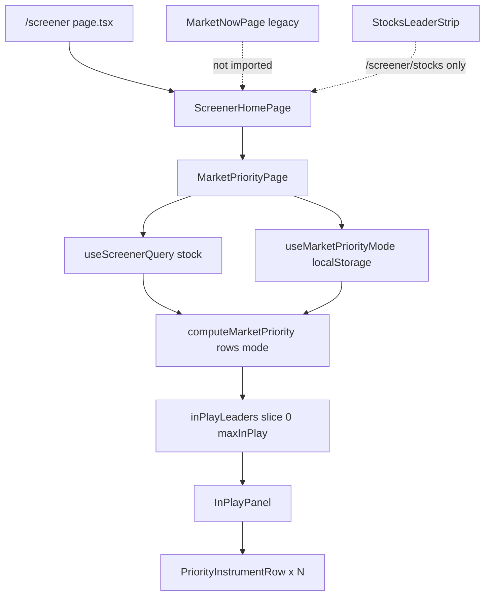

# Market Priority / In Play — Implementation Audit

**Дата:** 2026-07-06  
**Тип:** read-only аудит кода (изменений в коде не было)  
**Контекст:** на `/screener` блок «В игре» показывает слишком много акций; визуально страница почти не изменилась.

Связанные документы: `docs/MARKET_PRIORITY_PAGE_MODEL.md`, `docs/SITUATION_ENGINE.md`, `docs/SCREENER_TERMINAL_AUDIT.md`.

---

## Executive summary

### Главная причина раздувания «В игре»

На реальных MOEX-данных (2026-07-06, 496 строк, `source: moex`) engine **всегда насыщает список до hard max** режима:

| Режим | Фактический count | Hard max | Кандидатов с `inPlayScore ≥ 75` |
|-------|-------------------|----------|----------------------------------|
| strict | **8** | 8 | **64** |
| balanced | **10** | 10 | — |
| wide | **14** | 14 | — |

Причина не в UI (дублирования списка нет), а в **gate engine**, который на 99% universe работает через **legacy percentile `metrics.inPlayScore`**, а не через подтверждённые intraday-сигналы:

1. Только **3 из 496** строк имеют `intradayBaselineKind: "intraday-ok"` / `volumeRatioNow`.
2. У **496 из 496** строк есть backend `metrics.inPlayScore` (формула `screener-math.ts`: turnover/trades/range **percentile**).
3. `computeActivityShock()` при отсутствии ratio берёт `existingInPlayScore` **без понижающего множителя**.
4. `resolveConfidence()` из-за `inPlayScore` ставит **`medium`**, а не `low` → нет штрафа `low_confidence` и нет множителя `0.6`.
5. `countStrongReasons()` засчитывает **`turnoverParticipation`** (фактически rank по обороту/сделкам) как сильную причину — это ликвидность, не аномалия.
6. На активном рынке `rangeExpansion` (percentile rank + бонус за абсолютный range) даёт вторую «сильную» причину массово.

Итог: gate пропускает десятки кандидатов; `slice(0, maxInPlay)` всегда отдаёт **полный лимит** (8 / 10 / 14). Пользователь видит «много акций», хотя UI-кап работает.

### Почему визуально «почти ничего не изменилось»

- Список «В игре» по-прежнему **вертикальный список тикеров** (`PriorityInstrumentRow`), по плотности близкий к legacy `CompactInstrumentRow` / `MarketNowPage`.
- Переключатель Strict/Balanced/Wide **мелкий** (`text-[9px]`) в заголовке блока; без сравнения со старым UI разница неочевидна.
- При saturated gate смена strict→wide добавляет **+2 / +6 строк** — список и так выглядит «полным».
- Старые **KPI-карточки** `MarketNowPage` убраны, но заменены компактным `MarketPulseStrip` — общая страница остаётся «пульт со списками».

---

## 1. Что рендерится на `/screener`

### Цепочка маршрута

```
frontend/app/(app)/screener/page.tsx
  → <ScreenerHomePage />
frontend/components/screener/screener-home-page.tsx
  → <MarketPriorityPage />
```

### Факты

| Вопрос | Ответ по коду |
|--------|---------------|
| Корневой компонент | `ScreenerPage` → `ScreenerHomePage` → **`MarketPriorityPage`** |
| Используется ли `MarketPriorityPage`? | **Да**, единственный контент `ScreenerHomePage` |
| Параллельно рендерится `MarketNowPage`? | **Нет**. `MarketNowPage` существует в `market-now/market-now-page.tsx`, **нигде не импортируется** в актуальном route `/screener` |
| Параллельно `StocksLeaderStrip` / leaders strip? | **Нет** на `/screener`. `StocksLeaderStrip` только в `stocks-screener-page.tsx` (`/screener/stocks`) |
| Параллельно `MarketCommandCenter`? | **Нет** на prod-маршрутах |
| Откуда список «В игре»? | `MarketPriorityPage` → `computeMarketPriority(stocks, { mode: inPlayMode })` → `priority.inPlayLeaders` → `InPlayPanel` → `leaders.map(...)` |

### Источник данных

```typescript
// market-priority-page.tsx
const stocks = stocksQuery.data?.rows ?? [];
const priority = computeMarketPriority<ScreenerRow>(stocks, {
  maxLiquidity: 10,
  maxVolatility: 8,
  mode: inPlayMode,
});
```

`useScreenerQuery("stock")` → `GET /api/screener?assetClass=stock`.  
**`filterValidStockUniverse()` не вызывается** перед engine (в отличие от `stocks-radar.ts`).

### Legacy-стек (не на `/screener`, но живёт параллельно)

| Компонент / функция | Где используется | Связь с `/screener` |
|---------------------|------------------|---------------------|
| `MarketNowPage` + `selectHardInPlayInstruments` | файл есть, route не подключён | **нет** |
| `selectInPlayStocks` / `isStockInPlay` | `/screener/stocks`, таблицы, presets | **другой** критерий: `metrics.inPlayTags.includes("IN_PLAY")` из `screener-math.ts` |
| `StocksLeaderStrip` | `/screener/stocks` | **нет** на `/screener` |
| `buildStocksRadarModel` / `in-game-logic` | `/screener/stocks` radar | **нет** на `/screener` |

---

## 2. Как считается `inPlayLeaders`

### Вызов `computeMarketPriority`

- **Вызывается:** да, в `MarketPriorityPage` через `useMemo`.
- **Mode:** `inPlayMode` из `useMarketPriorityMode()`.
- **Default strict:** да — `DEFAULT_MARKET_PRIORITY_MODE = "strict"` в presets; `computeMarketPriority` fallback `options?.mode ?? DEFAULT_MARKET_PRIORITY_MODE`.

### localStorage

- Ключ: `screenerpro.marketPriority.mode` (`MARKET_PRIORITY_MODE_STORAGE_KEY`).
- Хук `useMarketPriorityMode`:
  1. Initial state: **`strict`** (до hydration).
  2. `useEffect` на mount: `readMarketPriorityModeFromStorage()` — **может перезаписать на `wide` / `balanced`**, если пользователь ранее выбирал режим.
- **Риск:** при сохранённом `wide` пользователь видит **14 строк**, не 8.

### Hard max

```typescript
// market-priority-engine.ts:851-852
inPlayCandidates.sort((a, b) => b.inPlayScore - a.inPlayScore);
inPlayCandidates = inPlayCandidates.slice(0, maxInPlay);
```

`maxInPlay` берётся из preset (`8` / `10` / `14`). **Hard cap применяется.**

### Фактические counts на live MOEX (2026-07-06)

Запрос: `GET /api/screener?assetClass=stock`, 496 rows, 251 eligible.

| Mode | `inPlayLeaders.length` | Tickers |
|------|------------------------|---------|
| strict | **8** | SPBE, NVTK, SMLT, UGLD, FESH, CBOM, IVAT, LKOH |
| balanced | **10** | + AQUA, MGKL |
| wide | **14** | + OZON, SVET, ALRS, TRNFP |

SBER **не** в списке (score 76.4, ниже top-8).  
Кандидатов с `inPlayScore ≥ 75`: **64** — gate не ограничивает, только cap.

### Отсутствующая логика из спецификации

- **Нет** `filterValidStockUniverse` в engine.
- **Нет** adaptive regime (повышение порога при >12 кандидатах) — в `MARKET_PRIORITY_PAGE_MODEL.md` §7.9 описано, в коде **не реализовано**.

---

## 3. Preset-логика — сверка с ожиданием

Источник: `frontend/lib/screener/market-priority-presets.ts`.

| Параметр | strict (код) | balanced (код) | wide (код) | Ожидание аудита |
|----------|--------------|----------------|------------|-----------------|
| minScore | 75 ✓ | 70 ✓ | 62 ✓ | ✓ |
| minPercentile | 92 ✓ | 90 ✓ | 85 ✓ | ✓ |
| minStrongReasons | 2 ✓ | 2 ✓ | 1 ✓ | ✓ |
| maxInPlay | 8 ✓ | 10 ✓ | 14 ✓ | ✓ |
| allowSoftRisk | **false** ✓ | **true** (`softRiskMinScore: 80`) | **true** (`softRiskMinScore: 62`) | balanced: аудит ожидает **forbidden** |

### Отличие от чеклиста аудита

**Balanced + softRisk:** в коде softRisk **разрешён** при `inPlayScore ≥ 80` (`allowSoftRisk: true`).  
В `MARKET_PRIORITY_PAGE_MODEL.md` §7.11 таблица тоже говорит `score ≥ 80`, не «forbidden».  
Если продуктовая цель — **полный запрет** softRisk в balanced (как в strict), это **расхождение с текущим preset**.

Пороги score/percentile/max **в presets совпадают** с документацией. Проблема не в presets, а в **семантике strong reasons** и **activityShock fallback**.

---

## 4. Strong reasons audit

### Как считается сейчас

Gate использует **не reason codes**, а флаги компонент scores:

```typescript
// market-priority-engine.ts:832-838
function countStrongReasons(w: Working): number {
  if (w.scores.strongActivity) n++;      // activityShock >= 65
  if (w.scores.strongRange) n++;         // rangeExpansion >= 65
  if (w.scores.strongTurnover) n++;      // turnoverParticipation >= 65  ← BUG
  if (w.scores.strongDirectional) n++;   // directionalPressure >= 65
}
```

`turnoverParticipation = valueRankScore * 0.6 + tradesRankScore * 0.4` — **чистый cross-sectional rank ликвидности**.

### Ожидаемые codes (аудит)

Должны засчитываться только:

- `activity_shock_confirmed`
- `range_expansion_confirmed`
- `directional_pressure_confirmed`
- `turnover_participation_confirmed`

### Факт

**Ни один `*_confirmed` code в кодовой базе не существует.**  
`buildReasons()` эмитит другие codes: `money_in_stock`, `many_trades`, `activity_shock`, `range_expanded`, `near_high`, `spread_ok`, etc.

### Что ошибочно засчитывается как «сильное»

| Механизм | Проблема |
|----------|----------|
| `strongTurnover` | Rank по обороту/сделкам ≈ **liquidity / money / many_trades** |
| `strongActivity` при fallback | `activityShock` из `metrics.inPlayScore` (percentile backend) ≈ **generic score / cross-sectional activity** |
| `valueRatio` в `computeActivityShock` | `metrics.turnoverVsAverage` участвует в ratios — **value rank**, не Vol x |

### Live-пример (strict leaders)

| Ticker | `confidence` | Reason codes на поверхности |
|--------|--------------|----------------------------|
| SPBE | medium | `money_in_stock`, `many_trades`, `activity_shock`, `range_expanded`, `strong_move` |
| SBER (не в top-8, score 76.4) | medium | `money_in_stock`, `many_trades`, `activity_shock`, `near_high`, `strong_move` |

---

## 5. Activity shock audit

### Реализация `computeActivityShock`

```typescript
// Порядок fallback:
1. max(activityRatio, volumeRatio, tradesRatio, valueRatio) / 3 → * 100
2. max(existingInPlayScore, activityScore, situationScore)  // metrics.inPlayScore!
3. crossSectionalRank * (0.6 | 0.8 | 1.0)  // avg(value, trades, volume rank scores)
```

### Факты vs спецификация

| Проверка | Результат |
|----------|-----------|
| Без baseline/ratio используется value/trades/volume rank? | **Да** — шаг 2 (`inPlayScore`) для 496/496 строк; шаг 3 для остальных без score |
| Вечные ликвиды становятся «аномальными»? | **Да, частично** — SBER score 76.4, `activity_shock` reason; отсекается только top-N cap, не gate |
| Понижается ли confidence? | **Нет** для большинства: `resolveConfidence()` → `medium` если есть `inPlayScore`, даже без baseline |
| Fallback как strong reason? | **Да** — `strongActivity = activityShock >= 65` срабатывает на percentile `inPlayScore` |

### Покрытие baseline на live

| Метрика | Count / 496 |
|---------|-------------|
| `volumeRatioNow` | 3 |
| `intradayBaselineKind === "intraday-ok"` | 3 |
| `metrics.inPlayScore > 0` | 496 |

**99.4% universe** не имеет надёжного intraday baseline, но engine ведёт себя как при `medium` confidence.

---

## 6. Range expansion audit

### Реализация

```typescript
function computeRangeExpansion(f, rangeRankScore) {
  const range = Math.abs(f.rangePct ?? 0);
  let bonus = 0;
  if (range >= 2.5) bonus = 25;
  else if (range >= 1.5) bonus = 12;
  return clampScore(rangeRankScore * 0.75 + bonus);
}
```

### Факты

| Проверка | Результат |
|----------|-----------|
| Абсолютный minimum range threshold для gate? | **Нет** — только бонус к score |
| Используется percentile/rank? | **Да** — `rangeRankScore` = `safeNormalizeRank(rangeRank, total)` |
| Раздувает список на активном рынке? | **Да** — при широком рынке многие бумаги получают `strongRange`; в паре с `strongTurnover` легко `minStrongReasons ≥ 2` |

Спецификация §7.2 допускает `dayRangePct ≥ 1.5` как активную причину — в gate это **не отделено** от percentile; достаточно `rangeExpansion >= 65`.

---

## 7. SoftRisk audit

### Gate

```typescript
function passesSoftRiskGate(w) {
  if (w.riskReasons.length === 0) return true;
  if (!inPlayPreset.allowSoftRisk) return false;
  if (softRiskMinScore != null && w.inPlayScore < softRiskMinScore) return false;
  return true;
}
```

### Может ли softRisk попасть в Strict / Balanced?

| Режим | Факт |
|-------|------|
| **Strict** | **Нет** — `allowSoftRisk: false`; verify подтверждает |
| **Balanced** | **Да** — при `riskReasons.length > 0` и `inPlayScore ≥ 80` |
| **Wide** | **Да** — при `inPlayScore ≥ 62` |

На live MOEX (2026-07-06): **0 softRisk строк** во всех режимах — ликвидные лидеры не триггерят `evaluateSoftRisk` (достаточно trades/turnover).

`evaluateSoftRisk` также добавляет `low_confidence` при `confidence === "low"`, но из-за `inPlayScore` → `medium` этот триггер **почти никогда не срабатывает**.

---

## 8. UI count audit

### `InPlayPanel`

```typescript
{leaders.map((inst) => (
  <PriorityInstrumentRow key={inst.secid} instrument={inst} variant="in-play" />
))}
```

- **Нет** локального `.slice()` или пагинации.
- **Нет** пути показать больше hard max — массив уже обрезан в engine.
- Count в `MarketPulseStrip`: `priority.inPlayLeaders.length` — совпадает с числом строк.

### Hard invariant

| Mode | UI max | Engine max | Нарушение |
|------|--------|------------|-----------|
| strict | 8 | 8 | **нет** |
| balanced | 10 | 10 | **нет** |
| wide | 14 | 14 | **нет** |

**Вывод:** UI не может показать > hard max. «Слишком много» = **содержательно** (8–14 ликвидных/активных имён вместо 2–4 аномалий), не технический баг рендера.

---

## 9. Verify script audit

Файл: `frontend/scripts/verify-market-priority-engine.ts`  
Команда: `pnpm -C frontend verify:market-priority` — **проходит** (2026-07-06).

| Тест (аудит) | Покрыт? |
|--------------|---------|
| Реальные лимиты количества (strict ≤ 8 и т.д.) | **Нет** — только `wide >= strict` на малом mock-universe (~10 тикеров) |
| strict ≤ balanced ≤ wide | **Частично** — inequality на mock, не на saturated market |
| strict никогда не показывает softRisk | **Да** |
| fallback activity не считается strong reason | **Нет** |
| SBER-like не попадает в in_play | **Да** — но mock с `volumeRatioNow: 1.0`, не live percentile fallback |
| thin spike не в in_play | **Да** |
| 64 кандидата → cap 8 | **Нет** |
| `turnoverParticipation` не как strong reason | **Нет** |

Verify **зелёный**, но **не ловит** регрессию, из-за которой live-список всегда заполнен до max.

---

## 10. Build audit

| Факт | Значение |
|------|----------|
| `frontend/.next/BUILD_ID` | **2026-07-06 11:31** |
| mtime `market-priority-engine.ts` | 2026-07-06 11:29 |
| mtime `market-priority-presets.ts` | 2026-07-06 11:29 |
| mtime `market-priority-page.tsx` | 2026-07-06 11:30 |

**Вывод:** `pnpm -C frontend build` **был запущен после последних правок** engine/UI (build на ~1–2 мин новее файлов).

---

## Список конкретных багов / отклонений

| # | Severity | Описание |
|---|----------|----------|
| B1 | **Critical** | `computeActivityShock` использует backend `metrics.inPlayScore` (percentile turnover/trades/range) — In Play деградирует в «топ ликвидов/движущихся», не «аномалия vs own baseline» |
| B2 | **Critical** | `countStrongReasons` засчитывает `turnoverParticipation` (rank value+trades) — запрещённая liquidity-причина |
| B3 | **High** | `resolveConfidence` → `medium` при наличии `inPlayScore` без baseline — нет `low` + множителя 0.6 |
| B4 | **High** | `valueRatio` (`turnoverVsAverage`) в activity shock ratios — подмена Vol x |
| B5 | **High** | Gate saturated: 64 кандидата при strict, всегда 8 строк — режимы отличаются только cap, не качеством |
| B6 | **Medium** | Нет adaptive regime (§7.9 модели) |
| B7 | **Medium** | Нет `filterValidStockUniverse` перед engine |
| B8 | **Medium** | Strong reasons не используют `*_confirmed` codes — спецификация не реализована |
| B9 | **Low** | `rangeExpansion` без абсолютного floor в gate — percentile раздувает на активном рынке |
| B10 | **Low** | Balanced допускает softRisk (если продукт хочет forbidden — отклонение) |
| B11 | **Low** | Verify не покрывает live-like сценарий |
| B12 | **UX** | Визуальная схожесть со старым списком; saturated list ощущается как «ничего не изменилось» |

---

## Какие файлы менять (рекомендация, без правок в этом аудите)

| Файл | Что менять |
|------|------------|
| `frontend/lib/screener/market-priority-engine.ts` | `computeActivityShock`, `resolveConfidence`, `countStrongReasons`, `computeRangeExpansion`, optional `filterValidStockUniverse`, adaptive cap |
| `frontend/lib/screener/market-priority-presets.ts` | Уточнить balanced softRisk policy (если forbidden) |
| `frontend/components/screener/market-priority/market-priority-page.tsx` | Передавать filtered universe; опционально spread enrich |
| `frontend/scripts/verify-market-priority-engine.ts` | Тесты: saturated market, SBER с `inPlayScore` fallback, strong reason invariants, max counts |
| `docs/MARKET_PRIORITY_PAGE_MODEL.md` | Синхронизировать §7.9 adaptive regime (implemented vs planned) |

---

## Инварианты для добавления

1. **Strict in_play count ≤ 8** (и аналоги 10 / 14) — уже есть; добавить verify на **mock saturated universe**.
2. **`activity_shock_confirmed` только при** `baselineReliable && (volumeRatioNow ≥ X || tradesRatioNow ≥ Y)` — иначе не strong reason.
3. **`turnover_participation_confirmed` только при** событии (share / absolute turnover floor), **не** при top rank alone.
4. **Запрет strong** от `money_in_stock`, `many_trades`, `spread_ok`, `activity_shock` без confirmed baseline.
5. **SBER-like:** `volumeRatioNow ≈ 1`, narrow range → **never** `in_play` (live + mock).
6. **THIN spike:** hard exclude или volatility only (уже частично).
7. **Без baseline:** `confidence = low`, `activityShock` max из cross-sectional с ×0.6; **не** использовать `metrics.inPlayScore`.
8. **Candidates after gate < max** на quiet day — допустим короткий список.
9. **strict ⊆ balanced ⊆ wide** по множеству тикеров при одном snapshot.
10. **strict ∩ softRisk = ∅**.

---

## Приложение: архитектурная схема (факт)



---

*Аудит выполнен read-only. Код не изменялся.*
