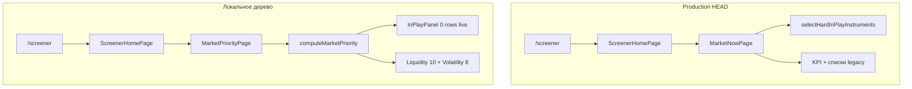

# Market Priority — Reality Audit

**Дата:** 2026-07-06  
**Тип:** read-only аудит (код не менялся)  
**Задача:** почему после Market Priority Page на `/screener` визуально почти ничего не изменилось и блок «В игре» выглядит раздутым.

Связанные документы: `docs/MARKET_PRIORITY_PAGE_MODEL.md`, `docs/MARKET_PRIORITY_IMPLEMENTATION_AUDIT.md`, `docs/UI_NUMBERS_MINIMALISM.md`.

---

## Executive summary

| Вопрос | Ответ |
|--------|--------|
| **Главная причина «ничего не изменилось»** | **Production / git `HEAD` всё ещё рендерит `MarketNowPage`**, не `MarketPriorityPage`. Новая страница есть только в **незакоммиченном** рабочем дереве. |
| **Главная причина «В игре раздуто»** | Зависит от версии engine: **промежуточный engine (утренний аудит)** насыщал список до cap 8/10/14 через percentile/fallback; **текущий engine v2 (локально)** на live MOEX даёт **0 строк** — «раздутость» тогда это **визуальная плотность соседних блоков** (Liquidity 10 + Volatility 8 + фьючерсы 6) и **крупная пустая cyan-зона** (`min-h-[280px]`). |
| **Что менять первым** | 1) Задеплоить route `screener-home-page.tsx` → `MarketPriorityPage`. 2) Довести data pipeline: `volumeRatioNow` / intraday baseline (сейчас 3/496). 3) UI-плотность карточки in-play. |

**Команды (2026-07-06):**

- `pnpm -C frontend verify:market-priority` — **OK**
- `pnpm -C frontend build` — **OK** (build 12:13, `market-priority-engine.ts` 11:51 — build **после** последней правки engine)

---

## A. Факт: что реально рендерится на `/screener`

### A.1 Цепочка маршрута

```
frontend/app/(app)/screener/page.tsx
  → <ScreenerHomePage />
```

| Слой | Локальное рабочее дерево (факт на диске) | Git `HEAD` / production deploy |
|------|------------------------------------------|--------------------------------|
| `screener-home-page.tsx` | `return <MarketPriorityPage />` | `return <MarketNowPage />` |
| `market-priority/*` | **есть** (untracked) | **нет в репозитории** |
| `market-priority-engine.ts` | **есть** (untracked) | **нет в репозитории** |

**Вывод:** локальный `pnpm dev:live` на `localhost:3000` отдаёт **новую** страницу. **Vercel / `HEAD`** — **старую** `MarketNowPage`.

### A.2 Корневой UI (локально — Market Priority Page)

`MarketPriorityPage` (`market-priority-page.tsx`):

1. `MarketPulseStrip` — одна строка: источник, время, всего / eligible / в игре  
2. Desktop grid: **Liquidity Rail** (10) | **In Play** | **Volatility** (8)  
3. Mobile stack: In Play → Liquidity → Volatility  
4. CTA: ссылки «Таблица акций →» `/screener/stocks`, «Фьючерсы →»  
5. Хвост: до **6** фьючерсов через legacy `CompactInstrumentRow`

**Нет** на `/screener`:

- `MarketNowPage` — не импортируется в локальном `screener-home-page.tsx`
- `StocksRadarTable` / длинная таблица — только на `/screener/stocks`
- `StocksLeaderStrip` — только `/screener/stocks`
- `MarketCommandCenter` — не на prod-маршрутах
- KPI-карточки `MarketKpiCard` — убраны в новой странице

**Есть** legacy-компонент в хвосте: `CompactInstrumentRow` для фьючерсов (визуально близок к старым спискам).

### A.3 Git `HEAD` — что видит production

`MarketNowPage`:

- `MarketStatusStrip` + **3 KPI-карточки**
- `InPlayTable` ← `selectHardInPlayInstruments(stocks).slice(0, 12)` — отдельный legacy-селектор, **не** `computeMarketPriority`
- Блоки: топ оборота (6), импульсы (5), у экстремума (5), опасные (5), фьючерсы (10)

На live MOEX **сегодня** legacy `hardInPlay` = **1 тикер (SBER)** — не 12.

### A.4 Visual invariant: пульт vs таблица

| Проверка | `/screener` (локально) | `/screener` (HEAD) |
|----------|------------------------|---------------------|
| Длинная таблица как основной слой | **Нет** | **Нет** |
| Основной контент | 3 компактных списка + pulse | KPI + несколько списков |
| Доминирующий слой при переходе на stocks | Ссылка внизу → `/screener/stocks` | То же |

**Инвариант «пульт, не таблица» на `/screener` не нарушен** ни в одной версии. Нарушение ощущения «пульт» возможно, если пользователь кликает «Таблица акций» или сравнивает с ожиданием карточного layout из §10 модели.

---

## B. Причина: почему «В игре» раздут или визуально не изменился

### B.1 «Визуально почти ничего не изменилось»

1. **Deploy gap** — на production всё ещё `MarketNowPage`; продуктовая смена не дошла до пользователя вне локального dev.
2. **Тот же примитив строки** — `PriorityInstrumentRow` ≈ `CompactInstrumentRow` / `InPlayTable`: тикер + цифры + chips, вертикальный список.
3. **Переключатель Strict/Balanced/Wide** — `text-[9px]`, в углу заголовка; без debug-воронки разница режимов неочевидна.
4. **Суммарная плотность экрана** — даже при пустом In Play на экране **~18 строк инструментов** (10 liquidity + 8 volatility) + до 6 фьючерсов ≈ как несколько legacy-блоков.
5. **KPI убраны, pulse компактный** — верх страницы стал тоньше, но списки остались главным визуальным массивом → субъективно «то же самое».

### B.2 «В игре» раздуто — три сценария

| Сценарий | Когда | Что видит пользователь |
|----------|-------|------------------------|
| **S1. Промежуточный engine (утро 2026-07-06)** | До elite gate v2 | strict **8**, balanced **10**, wide **14** — cap всегда заполнен. См. `MARKET_PRIORITY_IMPLEMENTATION_AUDIT.md`. |
| **S2. Текущий engine v2 + live MOEX** | Сейчас локально | **0** строк In Play; cyan-блок с empty copy, но `min-h-[280px]` на desktop — **визуально большая пустая зона**, не «много тикеров». |
| **S3. Production HEAD** | Vercel | Legacy `InPlayTable`, сегодня **1** строка (SBER) — не раздуто по count, но **та же семантика «в игре»** через другой селектор. |

**localStorage `screenerpro.marketPriority.mode`:**

- Default код: `strict`
- После hydration может стать `wide` / `balanced`, если пользователь переключал
- На **текущем** live snapshot режим **не влияет на count** (везде 0)
- На **промежуточном** engine `wide` давал **+6 строк** vs strict (14 vs 8) — усиливал ощущение раздутости

---

## C. Где баг: route / data / engine / UI / localStorage / legacy

| Зона | Severity | Факт |
|------|----------|------|
| **Route / deploy** | **Critical** | `MarketPriorityPage` не в `HEAD`; production ≠ локальная разработка. |
| **Data** | **Critical** | Из 496 строк MOEX: `volumeRatioNow` — **3**, `intradayBaselineKind: intraday-ok` — **3**, `tradesRatioNow` — **0**, `turnoverVsAverage` — **0**, `spreadPct` на row — **0**. Без baseline **невозможен** `activity_shock_confirmed`. |
| **Engine v2 (текущий)** | **High** | Gate работает строго: **0** кандидатов после score (max `inPlayScore` ≈ **57.6** &lt; wide min **62**). `fallbackActivityCount` = **493/496**. |
| **Engine v1 (промежуточный)** | **Critical** (fixed locally) | Percentile `metrics.inPlayScore` + `strongTurnover` → saturated 8/10/14. Описано в `MARKET_PRIORITY_IMPLEMENTATION_AUDIT.md`. |
| **UI** | **Medium** | In-play row: score + change + range + turnover + 2 chips (**4–5 чисел**, нарушение `UI_NUMBERS_MINIMALISM` §1). Пустой блок растянут `min-h-[280px]`. |
| **localStorage** | **Low** (сейчас) | Может стартовать не strict; на live v2 count не меняется. На v1 wide = 14 строк. |
| **Legacy parallel** | **Low** на `/screener` | `selectHardInPlayInstruments` только в `MarketNowPage` (HEAD). Фьючерсный хвост — `CompactInstrumentRow`. |

---

## 1. Data — источник и поля

### Источник

```typescript
// market-priority-page.tsx
useScreenerQuery("stock") → GET /api/screener?assetClass=stock
const stocks = stocksQuery.data?.rows ?? [];  // без filterValidStockUniverse
```

| Метрика | Значение (MOEX, 496 rows, 2026-07-06) |
|---------|----------------------------------------|
| `rows.length` | 496 |
| `filterValidStockUniverse` перед engine | **не вызывается** |
| `metrics.volumeRatioNow` | 3 |
| `metrics.tradesRatioNow` | 0 |
| `metrics.intradayBaselineKind === intraday-ok` | 3 |
| `metrics.turnoverVsAverage` | 0 |
| `metrics.dayRangePct` | 417 |
| `metrics.inPlayScore > 0` | 496 (backend percentile — **не используется** в v2 gate) |
| `spreadPct` на row | 0 |

**Ratio/baseline на live:** почти отсутствуют. Cross-sectional ranks считаются engine из turnover/trades/volume/range внутри `computeMarketPriority`, но **не дают strong abnormality** без ratio.

---

## 2. Engine — counts strict / balanced / wide

Запуск: `computeMarketPriority(rows)` на `GET /api/screener?assetClass=stock` (localhost + production API — одинаковый snapshot).

### 2.1 Сводная таблица (текущий engine v2)

| Mode | total | eligible | hardExcluded | inPlay | liquidity | volatility | softRisk in inPlay |
|------|-------|----------|--------------|--------|-----------|------------|-------------------|
| **strict** | 496 | 261 | 235 | **0** | 10 | 8 | 0 |
| **balanced** | 496 | 261 | 235 | **0** | 10 | 8 | 0 |
| **wide** | 496 | 261 | 235 | **0** | 10 | 8 | 0 |

### 2.2 Gate funnel (все режимы, live MOEX)

| Поле stats | Значение |
|------------|----------|
| `candidatesBeforeGate` | 261 |
| `candidatesAfterScore` | **0** |
| `candidatesAfterReasons` | 0 |
| `candidatesAfterPercentile` | 0 |
| `finalInPlayCount` | 0 |
| `fallbackActivityCount` | 493 |
| `softRiskRejected` | 0 |

**Тикеры In Play (strict):** *(пусто)*

**Тикеры Liquidity (top 5):** LQDT, SBER, T, VTBR, GAZP

**SBER:** только Liquidity Rail; `inPlayScore` 32.7; strong reasons **нет**.

### 2.3 Сравнение с утренним аудитом (промежуточный engine)

`MARKET_PRIORITY_IMPLEMENTATION_AUDIT.md` (тот же API, **старый** gate):

| Mode | inPlay count | Tickers (пример) |
|------|--------------|------------------|
| strict | **8** | SPBE, NVTK, SMLT, UGLD, FESH, CBOM, IVAT, LKOH |
| balanced | **10** | + AQUA, MGKL |
| wide | **14** | + OZON, SVET, ALRS, TRNFP |

Это объясняет жалобу «раздуто» при тесте **до** elite gate v2.

### 2.4 Strong reasons — фактическая семантика (engine v2)

**Засчитываются в gate** только `PriorityReason` с `strength === "strong"` и `family ∈ { abnormality, range, direction, participation }`.

| Тип | Засчитывается как strong? | Факт на live eligible |
|-----|---------------------------|------------------------|
| `activity_shock_confirmed` | Да (`abnormality`) | **0** тикеров |
| `range_expansion_confirmed` | Да (`range`) | **124** тикеров |
| `directional_pressure_confirmed` | Да (`direction`) | **9** |
| `turnover_participation_confirmed` | Да (`participation`) | **1** (SAFE) |
| `money_in_stock`, `many_trades` | **Нет** (`liquidity`, weak) | surface only |
| `spread_ok` | **Нет** (weak) | — |
| `activity_fallback` | **Нет** (`fallback`, weak) | 493 fallback rows |
| Cross-sectional rank alone | **Нет** | — |

**Strict reason gate на live:** 9 тикеров с ≥2 strong, но **0** с strong `abnormality` → **0** проходят `minAbnormalityReasons: 1`.

**Не засчитываются (корректно в v2):** liquidity, spread_ok, many_trades, money, fallback, чистый rank.

**Остаточный риск:** `turnover_participation_confirmed` может стать strong при top rank + confirmed range/direction **без** Vol x (SAFE 57.6) — но score gate отсекает.

---

## 3. UI — In Play panel

| Проверка | Факт |
|----------|------|
| Max карточек strict / balanced / wide | 8 / 10 / 14 (engine hard cap) |
| Локальный `.slice()` в UI | **Нет** |
| Заполнение до max | На live v2 — **нет** (0 строк); на v1 — **всегда до cap** |
| Empty state | **Да** — «Нет чистых in-play сигналов…» |
| Старый список «активных» | **Нет** в `InPlayPanel`; legacy только в `MarketNowPage` (HEAD) |
| Debug воронка | dev или `?debugPriority=1` |

**Плотность строки in-play** (`priority-instrument-row.tsx`, variant `in-play`):

- `inPlayScore` (число)
- `changePct`, `range`, `turnover` (3 числа)
- до 2 `StatusChip` reason badges

→ **4–5 чисел на поверхности** (нарушение `docs/UI_NUMBERS_MINIMALISM.md` §1).

---

## D. Какие файлы нужно менять

| Приоритет | Файл | Зачем |
|-----------|------|-------|
| P0 | `frontend/components/screener/screener-home-page.tsx` | Закоммитить/задеплоить `MarketPriorityPage` |
| P0 | `frontend/components/screener/market-priority/*` | Весь UI-слой (сейчас untracked) |
| P0 | `frontend/lib/screener/market-priority-engine.ts` | Engine + gate |
| P0 | `frontend/lib/screener/market-priority-presets.ts` | Пороги режимов |
| P0 | `frontend/lib/hooks/use-market-priority-mode.ts` | localStorage mode |
| P1 | API / ingest / `screener-math` | Поставка `volumeRatioNow`, `tradesRatioNow`, `intradayBaselineKind` на universe |
| P1 | `frontend/components/screener/market-priority/priority-instrument-row.tsx` | Минимализм цифр на карточке |
| P1 | `frontend/components/screener/market-priority/market-priority-page.tsx` | `filterValidStockUniverse`; убрать/смягчить `min-h-[280px]` |
| P2 | `frontend/scripts/verify-market-priority-engine.ts` | Live-like fixture: MOEX snapshot без baseline |
| P2 | `frontend/lib/screener/market-priority-display.ts` | Поверхность badges |
| — | `frontend/components/screener/market-now/market-now-page.tsx` | Deprecate после deploy (не удалять сразу) |

---

## E. Инварианты для фиксации

1. **`/screener` рендерит только `MarketPriorityPage`** после merge — не `MarketNowPage`.
2. **Strict in_play ≤ 8**, balanced ≤ 10, wide ≤ 14 — hard cap в engine (уже есть).
3. **Strong reason whitelist** — только confirmed families; liquidity/fallback/rank **никогда** strong (v2 выполняет).
4. **Без intraday baseline** — `activity_shock_confirmed` недоступен; In Play **может и должен быть пустым** (норма).
5. **SBER при Vol x ≈ 1** — never strict in_play (verify OK).
6. **`metrics.inPlayScore` backend** — не участвует в gate (v2 OK).
7. **Первый экран `/screener`** — пульт (списки), не `StocksRadarTable`.
8. **Карточка in-play** — ≤ 3 числа на поверхности (`UI_NUMBERS_MINIMALISM`).
9. **localStorage mode** — default strict; UI показывает активный режим в pulse/debug.
10. **Verify** — сценарий «MOEX-like 496 rows, 3 baselines → in_play не saturated без confirmed shock».

---

## F. План фикса в 2–3 маленьких итерациях

### Итерация 1 — «Дойти до глаз пользователя»

- Закоммитить и задеплоить route + `market-priority/*` + engine + presets + hook.
- Проверить в браузере: заголовок «Пульт рынка», три зоны, нет KPI-карточек legacy.
- `?debugPriority=1` — убедиться, что funnel виден.

**DoD:** production `/screener` ≠ `MarketNowPage`.

### Итерация 2 — «Данные для In Play»

- Расширить ingest: `volumeRatioNow` / `tradesRatioNow` / `intradayBaselineKind` на top-N ликвидов (не только 3 тикера).
- Опционально: `filterValidStockUniverse` перед `computeMarketPriority`.
- Калибровка score floor: при наличии 2 confirmed (range + direction) но без baseline — не блокировать wide полностью (продуктовое решение).

**DoD:** на активном дне strict in_play = 1–3 тикера с реальным Vol x, не 0 и не 8 ликвидов.

### Итерация 3 — «Визуальная смена»

- `PriorityInstrumentRow` in-play: убрать `inPlayScore` с поверхности; оставить change + 1 контекст (vol x или range).
- Убрать `min-h-[280px]` или заменить на компактный empty.
- Укрупнить `InPlayModeSwitch`; pulse показывает режим явно.

**DoD:** пользователь без сравнения со старым UI видит **другую** иерархию; in-play row ≤ 3 числа.

---

## Приложение: схема (факт)



---

*Аудит выполнен read-only. Код не изменялся.*
