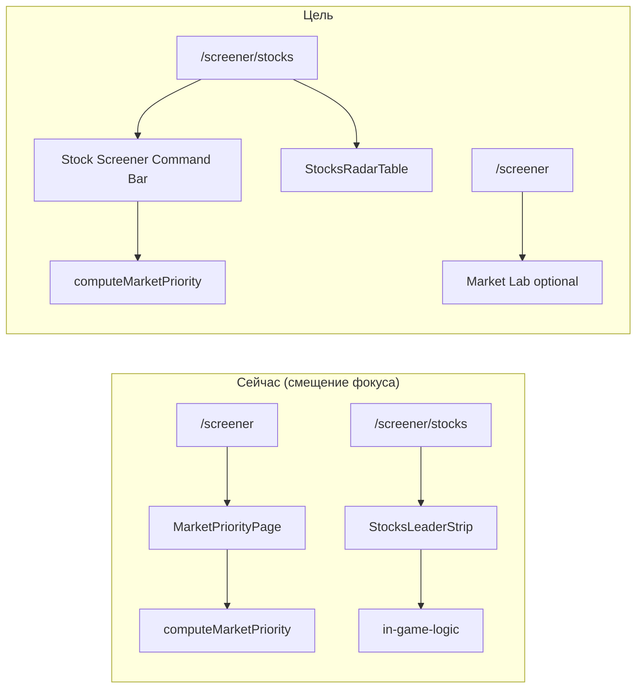

# Stock Screener Page — целевая архитектура

**ScreenerPRO · `/screener/stocks` («Акции»)**  
**Дата:** 2026-07-06  
**Статус:** продуктовая фиксация границ + **Command Bar на `/screener/stocks` реализован** (2026-07-06).

Связанные документы:

| Документ | Роль |
|----------|------|
| `docs/MARKET_PRIORITY_PAGE_MODEL.md` | Формулы и зоны Market Priority Engine |
| `docs/MARKET_PRIORITY_REALITY_AUDIT.md` | Факт: что сейчас на `/screener` |
| `docs/SITUATION_ENGINE.md` | Теги Setup в таблице |
| `docs/INTRADAY_SCREENER_TERMINAL_VISION.md` | North Star intraday terminal |
| `PRODUCT_VISION.md` | Скринер акций — ядро продукта |

---

## Контекст: исправление направления

Market Priority / In Play логика была внедрена на **главную «Рынок»** (`/screener`), тогда как продуктовый фокус — **раздел «Акции»** (`/screener/stocks`), главный рабочий скринер.

Этот документ фиксирует **правильные границы** и план переноса Command Bar на страницу акций **без** развития `/screener` как основного рабочего экрана.

---

## Route map (факт в репозитории)

| Маршрут | Route-файл | Главный компонент | Продуктовая роль |
|---------|------------|-------------------|------------------|
| `/screener` | `frontend/app/(app)/screener/page.tsx` | `ScreenerHomePage` → `MarketPriorityPage` | Market Lab / пульт-лаборатория. **Не основной рабочий скринер.** |
| `/screener/stocks` | `frontend/app/(app)/screener/stocks/page.tsx` | `StocksScreenerPage` | **Главный рабочий скринер акций.** |
| `/screener/futures` | `frontend/app/(app)/screener/futures/page.tsx` | `FuturesScreenerPage` | Будущий скринер фьючерсов. **Не трогать сейчас.** |
| `/sandbox` | `frontend/app/(app)/sandbox/page.tsx` | inline sandbox | Песочница raw-данных и отладки. Не production route. |
| `/lab/*` | `frontend/app/(app)/lab/*/page.tsx` | `LabPageShell` и др. | Черновики в sidebar «Черновики». Sandbox, не production. |

**Sidebar** (`frontend/lib/constants/navigation.ts`): группа «Рынок» — пункты **Рынок** (`/screener`), **Акции** (`/screener/stocks`), **Фьючерсы** (`/screener/futures`). Черновики — `sidebarDraftsNav` (`/lab/*`).

**Примечание:** `MarketCommandDeck` в коде **не существует**. Ближайшие сущности:

- `MarketPriorityPage` — текущий UI Market Priority на `/screener`
- `MarketCommandCenter` (`dashboard/market-command-center.tsx`) — **не подключён** ни к одному route
- `MarketNowPage` — legacy пульт, заменён локально на `MarketPriorityPage`, файл сохранён

---

## A. «Рынок» / `/screener` — не текущий фокус

### Роль

Market Lab / лаборатория приоритизации. Можно оставить как черновик Market Command Deck для экспериментов.

### Что сейчас подключено (факт)

| Компонент / модуль | На `/screener` |
|--------------------|----------------|
| `MarketPriorityPage` | ✓ через `screener-home-page.tsx` |
| `MarketPulseStrip` | ✓ |
| `InPlayPanel` | ✓ |
| `LiquidityRail` | ✓ |
| `VolatilityPanel` | ✓ |
| `computeMarketPriority` / `market-priority-engine` | ✓ |
| `?debugPriority=1` / `market-priority-debug` | ✓ |
| `InPlayGateDiagnostics` | ✓ (dev или query param) |

### Политика

- **Не развивать глубоко** как основной рабочий экран.
- Не переносить сюда таблицу акций.
- Engine и UI-компоненты **переиспользовать** на `/screener/stocks`, а не дублировать формулы.

---

## B. «Акции» / `/screener/stocks` — главный рабочий экран

### Текущая структура (факт, 2026-07-06)

```
StocksScreenerPage (stocks-screener-page.tsx)
├── Header: «Рынок · Акции» + DataQualityCompact
├── StocksIndexStrip (индекс, breadth, KPI сессии)
├── StockScreenerCommandBar ← market-priority-engine (NEW)
│   ├── InPlayPanel («В игре · фокус») + InPlayModeSwitch
│   ├── LiquidityRail («Где деньги», muted)
│   └── VolatilityPanel («Прострелы», amber)
├── Toolbar: «Скрыть неликвиды», счётчик, поиск по тикеру
└── StocksRadarTable ← основная таблица drill-down
```

**Данные Command Bar:** те же `stockUniverse` rows из `useScreenerQuery("stock")` → `computeMarketPriority(rows, { mode })` — **отдельный fetch нет**.

**Данные таблицы:** `buildStocksRadarModel()` в `stocks-radar.ts` — для нормализации строк, Setup-колонки и фильтров; **формулы In Play не дублируются** в React.

**Режим In Play на акциях:**

| Параметр | Значение |
|----------|----------|
| Hook | `useStockScreenerPriorityMode()` |
| localStorage | `screenerpro.stockScreener.priorityMode` |
| Default | `strict` |
| Caps | strict 5 · balanced 8 · wide 12 (engine, без добивания) |

**Debug funnel:** `InPlayGateDiagnostics` под заголовком In Play — dev или `?debugPriority=1`. Формат: `Strict · total N · eligible N · candidates N · final N`.

**Клик по строке Command Bar** → `focusedTicker` → highlight в `StocksRadarTable` (toggle).

### Устаревшая структура (до 2026-07-06)

```
StocksLeaderStrip ← legacy radar (in-game-logic) — **удалён с страницы**
```

**Таблица:** `StocksRadarTable` — колонки в константе `COLUMNS` внутри файла; rows — `NormalizedStockRow[]` после filter/sort; колонка **Setup** через `SituationSetupCell` / `situation-engine`.

**Virtual table:** текущая production-таблица — **обычный HTML `<table>`** без `@tanstack/react-virtual`. Legacy `StocksScreenerTable` (TanStack Table) **существует, но нигде не импортируется**. При миграции не ломать существующую таблицу и её API props.

**Верхняя зона:** есть компактный header + index strip + leader strip + мини-toolbar над таблицей. **Stock Screener Command Bar** можно безопасно вставить **между** `StocksIndexStrip` и toolbar таблицы (или вместо `StocksLeaderStrip` на итерации 2), не трогая virtualizer/рендер строк таблицы.

### Целевая компоновка: Stock Screener Command Bar

Над таблицей (primary drill-down остаётся таблицей):

```
┌─────────────────────────────────────────────────────────────┐
│ StocksIndexStrip + DataQuality (как сейчас)                 │
├─────────────────────────────────────────────────────────────┤
│ STOCK SCREENER COMMAND BAR                                  │
│ ┌─────────────────────┬──────────────┬─────────────────────┐│
│ │ In Play Focus       │ Liquidity    │ Volatility /        ││
│ │ 1–5 Strict          │ Podium       │ Прострелы           ││
│ │ главный блок        │ тихий список │ risk badges         ││
│ │ cyan                │ muted        │ amber               ││
│ └─────────────────────┴──────────────┴─────────────────────┘│
│ Debug funnel: только dev или ?debugPriority=1               │
├─────────────────────────────────────────────────────────────┤
│ Toolbar: неликвиды · поиск · счётчик                        │
│ StocksRadarTable (primary drill-down)                       │
└─────────────────────────────────────────────────────────────┘
```

| Зона Command Bar | Роль | Переиспользование |
|------------------|------|-------------------|
| **In Play Focus** | 1–5 бумаг Strict, главный сигнал | `InPlayPanel`, `computeMarketPriority({ mode: "strict" })` |
| **Liquidity Podium** | «Где деньги», **не сигнал** | `LiquidityRail` |
| **Volatility / Прострелы** | Риск-движения, неликвидные прострелы | `VolatilityPanel` |
| **Debug funnel** | Воронка gate | `InPlayGateDiagnostics`, `market-priority-debug` |

**Инварианты:**

- Liquidity **не** является причиной In Play (engine уже разделяет; UI не смешивать).
- Формулы **только** в `market-priority-engine.ts`, не в React-компонентах.
- `situation-engine` — теги в колонке Setup таблицы; не подменяет In Play score.

### Компоненты Command Bar (реализовано)

| Файл | Роль |
|------|------|
| `frontend/components/screener/stocks/stock-screener-command-bar.tsx` | Shell: layout desktop/mobile |
| `frontend/components/screener/market-priority/in-play-panel.tsx` | In Play Focus (переиспользован) |
| `frontend/components/screener/market-priority/liquidity-rail.tsx` | Liquidity Podium |
| `frontend/components/screener/market-priority/volatility-panel.tsx` | Прострелы / risk |
| `frontend/components/screener/market-priority/priority-instrument-row.tsx` | Строка инструмента (shortName, score, chips) |
| `frontend/lib/hooks/use-stock-screener-priority-mode.ts` | Режим Strict/Balanced/Wide |
| `frontend/lib/screener/market-priority-engine.ts` | `computeMarketPriority` — единый engine |
| `frontend/lib/screener/stock-screener-priority-filters.ts` | Quick filter sets из `MarketPriorityResult` |
| `frontend/components/screener/stocks/stock-screener-quick-filters.tsx` | Chips: Все / В игре / Ликвидность / Прострелы / Риск |

**Точка входа:** `stocks-screener-page.tsx` — между `StocksIndexStrip` и toolbar таблицы.

### Связь Command Bar ↔ таблица (2026-07-06)

**Click behavior**

| Действие | Поведение |
|----------|-----------|
| Клик в Command Bar | `selectedTicker` + `scrollIntoView` к строке таблицы (`nearest`, smooth) |
| Клик в таблице | toggle `selectedTicker` |
| Тикер вне активного quick filter | фильтр сбрасывается на «Все», затем scroll |
| Сброс | кнопка «Сбросить» в Command Bar |

Таблица — обычный HTML `<table>` (не virtualized); scroll безопасен через ref-map на `<tr>`.

**Quick filters** (`StockScreenerQuickFilters`)

| Фильтр | Источник (engine) |
|--------|-------------------|
| Все | без bucket-фильтра |
| В игре | `inPlayLeaders` secids |
| Ликвидность | `liquidityLeaders` secids |
| Прострелы | `volatilityLeaders` secids |
| Риск | `all` где `isEligible && riskReasons.length > 0` |

Пустой bucket → dedicated empty state (не fallback на все акции).

**Колонка «Ситуация»** (`SituationSetupCell`)

- primary tag + score (компактно)
- `risk` badge: `spread_risk` из situation-engine **или** soft risk из `computeMarketPriority`
- без перегрузки строки

**Memoization:** `computeMarketPriority` и `buildPriorityFilterSets` в `useMemo([stockUniverse, priorityMode])`.

### «Акции» vs «Рынок»

| | `/screener/stocks` | `/screener` |
|--|-------------------|-------------|
| Роль | **Главный рабочий скринер** | Market Lab / черновик |
| Command Bar | `StockScreenerCommandBar` + таблица | `MarketPriorityPage` (deck без таблицы) |
| Режим localStorage | `screenerpro.stockScreener.priorityMode` | `screenerpro.marketPriority.mode` |
| Развитие | **текущий фокус** | не углублять сейчас |

### Legacy на «Акции» (снято с рендера)

| Компонент | Стек | Заменить на |
|-----------|------|-------------|
| `StocksLeaderStrip` | `buildStocksRadarModel` + `in-game-logic` | ~~заменён~~ Command Bar (2026-07-06) |
| `StockTapeRow` | внутри leader strip | `PriorityInstrumentRow` |
| `in-game-logic` / `RADAR_THRESHOLDS` | отдельные пороги | `market-priority-presets` (постепенно) |

**Уже на акциях и оставить:**

- `StocksRadarTable`, `SituationSetupCell`, `StocksIndexStrip`, `DataQualityCompact`
- `ScreenerDevDebugPanel` (только dev)

### Что на «Акции» подключено (2026-07-06)

- `StockScreenerCommandBar`, `InPlayPanel`, `LiquidityRail`, `VolatilityPanel`
- `computeMarketPriority` / `market-priority-engine`
- `?debugPriority=1` (dev всегда)

**Не на акциях:** `MarketPriorityPage`, `MarketPulseStrip` (остаются на `/screener`).

---

## C. «Фьючерсы» / `/screener/futures`

Не трогать в рамках этой итерации. Отдельный `FuturesScreenerPage`, свой preset/table стек.

---

## D. Черновики

| Зона | Использование |
|------|---------------|
| `/sandbox` | Raw MOEX, расширенные колонки, `MarketRadarDebugPanel` |
| `/lab/*` | Экспериментальные лаборатории в sidebar «Черновики» |

Можно использовать как sandbox для прототипов Command Bar, **не** как production route для трейдера.

---

## Что нельзя делать

1. Развивать `/screener` («Рынок») вместо `/screener/stocks` («Акции») как основной экран.
2. Переносить таблицу акций на главную `/screener`.
3. Ломать `/screener/stocks` (маршрут, data fetch, сортировка, фильтр неликвидов).
4. Ломать `StocksRadarTable` и контракт `NormalizedStockRow` без необходимости.
5. Менять `/api/screener` контракт без необходимости.
6. Дублировать формулы ranking в React-компонентах.
7. Считать Liquidity причиной In Play.

---

## План миграции (3 итерации)

### Iteration 1 — подключить Market Priority Engine к stocks data

**Статус:** ✓ done (2026-07-06) — вместе с Iteration 2.

### Iteration 2 — Stock Screener Command Bar над таблицей

**Статус:** ✓ done (2026-07-06).

**DoD:** на `/screener/stocks` виден Command Bar; build green.

### Iteration 3 — связь In Play карточек с таблицей

**Статус:** ✓ done (2026-07-06) — highlight, scroll, quick filters, колонка «Ситуация», сброс выбора.

---

## Приложение: схема текущего vs целевого



---

*При изменении архитектуры обновлять этот файл и `AI_SESSION_STATE.md`.*
