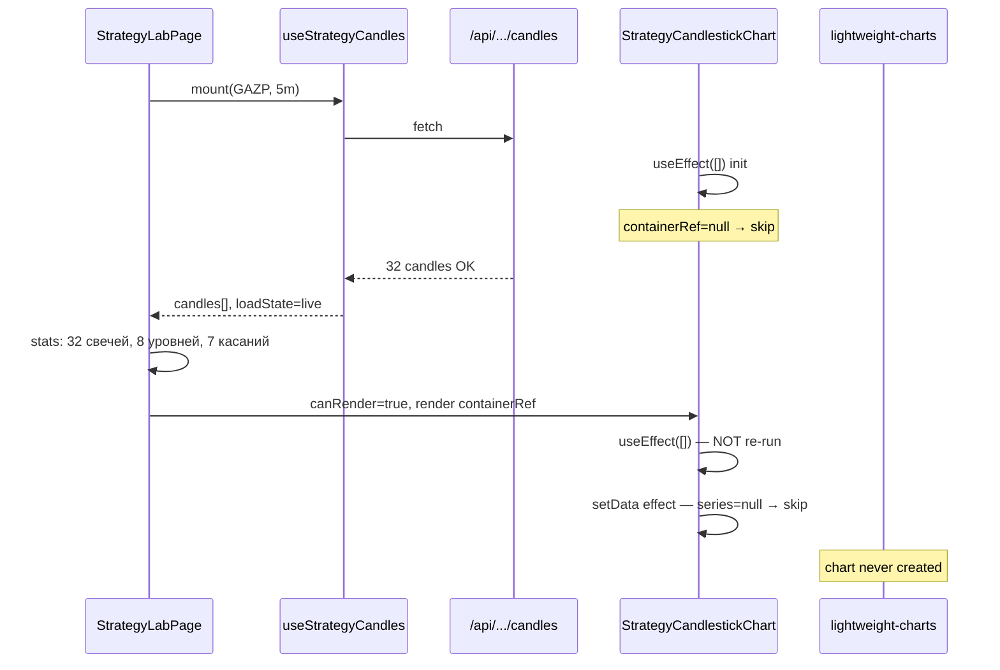

# Strategy Lab Chart Audit — пустой график при «Свечей 31»

**ScreenerPRO · `/screener/strategies` · GAZP 5m**  
**Дата:** 2026-07-07  
**Статус:** ✅ **исправлено** (2026-07-07) — chart lifecycle + normalizer + layout

Связанные документы: `docs/STRATEGY_LAB_TARGET.md`, `docs/ROUND_LEVELS_STRATEGY.md`, `AI_SESSION_STATE.md`

---

## Resolution (2026-07-07)

| Вопрос | Было | Стало |
|--------|------|-------|
| Пустой chart | init-effect `[]` при loading | init при `canRender=true` |
| Normalization | string ISO time | `strategy-candles-normalizer.ts` → UNIX seconds |
| Overlays | всегда on | `overlaysEnabled={false}` на странице |
| Layout | `max-w-[1600px]`, panel 208px | full width, panel 320–340px, chart 420/620/700px |

**Следующий шаг:** включить overlays поэтапно — levels → buffers → markers.

---

## Executive summary (original audit)

| Вопрос | Ответ |
|--------|-------|
| **Почему «Свечей 31» есть, но свечей не видно?** | Данные и аналитика работают; `lightweight-charts` **никогда не создаётся**, потому что init-effect срабатывает при mount, когда контейнер ещё не в DOM (идёт загрузка). |
| **Что невалидно?** | **Chart lifecycle** — единственная блокирующая причина. Data / time / CSS / overlay — OK или вторичны. |
| **Что менять первым?** | `strategy-candlestick-chart.tsx` — привязать создание chart к `canRender` (паттерн `stock-expanded-chart.tsx`). |

---

## A. Почему «Свечей 31» есть, но свечей не видно

Правая панель и движки уровней/реакций читают `candles` из `useStrategyCandles` **напрямую**, без chart:

```
useStrategyCandles → strategyCandlesFromExpandedSeries → candles[]
  ├─ StrategyStatsPanel (счётчик «Свечей»)
  ├─ computeStrategyLevelsFromCandles → «Уровней 8/8»
  └─ analyzeRoundLevelReactions → «Касаний 7»

StrategyCandlestickChart
  └─ createChart(containerRef)  ← НЕ вызывается (см. §3)
```

Пользователь видит тёмный прямоугольник (`bg-black/25`, `h-[420px]`) — это shell chart area **без canvas** внутри `containerRef`.

---

## B. Что именно невалидно

### B.1 Data fetch — ✅ OK

| Параметр | Значение |
|----------|----------|
| Endpoint | `GET /api/screener/stocks/candles` |
| URL (GAZP 5m) | `/api/screener/stocks/candles?view=chart&secid=GAZP&interval=5` |
| `secid` | `GAZP` |
| `board` | `TQBR` (implicit в сервере, не в query) |
| `interval` | `5` (минуты) |
| `from` / `till` | не передаются; сервер берёт **текущий торговый день МСК** (`moscowDateKey()`) |
| HTTP | 200 (через `buildStockExpandedChartSeries`, без ошибки) |

**Фактические counts (аудит 2026-07-07 ~09:34 МСК):**

| Метрика | Значение |
|---------|----------|
| `series.status` | `ok` |
| `series.source` | `intraday` |
| raw candles | **32** (UI мог показать 31 — сдвиг по времени сессии) |
| normalized candles | **32** |
| invalid OHLC | **0** |

**Поля raw candle (пример first):**

```json
{
  "time": "2026-07-07T06:59:00+03:00",
  "open": 94.81,
  "high": 94.99,
  "low": 94.8,
  "close": 94.88,
  "volume": 116050
}
```

MOEX поля `begin` маппятся в `timestamp` ISO с `+03:00` (`mapIntradayCandlesBars`).

Пустой/error UI не показывается, потому что `loadState === "live"` и `candleCount > 0` — данные реально есть.

**Цепочка fetch:**

| Файл | Роль |
|------|------|
| `frontend/lib/hooks/use-strategy-candles.ts` | client fetch |
| `frontend/app/api/screener/stocks/candles/route.ts` | API route (`view=chart`) |
| `frontend/lib/server/services/stock-expanded-candles.ts` | MOEX ISS, агрегация 1m→5m |

---

### B.2 Candle normalization — ✅ OK

| Поле | Формат | Статус |
|------|--------|--------|
| `time` | ISO string `2026-07-07T06:59:00+03:00` | ✅ |
| `open/high/low/close` | finite number | ✅ |
| `high >= max(o,c)`, `low <= min(o,c)` | все 32 свечи | ✅ |
| sort asc | по `timeSortKey` | ✅ |
| duplicate time | dedupe в `normalizeStrategyCandles` | ✅ 32 unique |

**Конвертация для lightweight-charts** (`toChartTime` в chart):

```
"2026-07-07T06:59:00+03:00" → 1783396740 (UTCTimestamp seconds)
```

- first chart time: `1783396740`
- last chart time: `1783406040`
- sorted asc: **true**
- unique times: **32 / 32**

Требования lightweight-charts для intraday выполняются.

---

### B.3 Chart lifecycle — ❌ ROOT CAUSE

**Файл:** `frontend/components/strategies/strategy-candlestick-chart.tsx`

#### Проблема: init-effect с `[]` deps при условном рендере контейнера

```tsx
// Mount: isLoading=true, candles=[], canRender=false
{isLoading && !canRender ? <ChartMessage /> : ... : !canRender ? <ChartMessage /> : (
  <div ref={containerRef} ... />  // ← в DOM только после загрузки
)}

React.useEffect(() => {
  const el = containerRef.current;
  if (!el) return;           // ← при mount el === null → early return
  const chart = createChart(el, ...);
  ...
}, []);                        // ← никогда не перезапускается

React.useEffect(() => {
  if (!candleSeries || !chart || !canRender) return;  // ← series null
  candleSeries.setData(...);
}, [candles, source, canRender, touchMarkers]);
```

**Timeline:**

1. Mount → loading → `containerRef` **не в DOM**
2. Init-effect (`[]`) → `containerRef.current === null` → chart **не создан**
3. Fetch завершён → `canRender=true` → контейнер появляется в DOM
4. Init-effect **не перезапускается** (`[]`)
5. setData-effect → `candleSeriesRef.current === null` → **setData не вызывается**
6. Итог: пустой shell, stats panel с данными

#### Сравнение с рабочим паттерном

`frontend/components/screener/stocks/stock-expanded-chart.tsx`:

```tsx
React.useEffect(() => {
  const el = containerRef.current;
  if (!el || !canRender || !series) return;
  const chart = createChart(el, ...);
  candles.setData(toCandleData(series));
  ...
  return () => chart.remove();
}, [canRender, row, series]);  // ← пересоздаёт chart когда данные готовы
```

| Проверка | Strategy chart | Stock expanded chart |
|----------|----------------|----------------------|
| client-only (`"use client"`) | ✅ | ✅ |
| container width/height > 0 (когда в DOM) | ✅ shell `h-[420px]` | ✅ |
| candlestick series создаётся | ❌ never | ✅ |
| `setData` после series | ❌ never | ✅ |
| `fitContent` после setData | ❌ never | ✅ |
| `chart.remove()` on unmount | N/A (chart null) | ✅ |
| нет пересоздания на каждый render | ✅ (но и не создаётся) | пересоздаёт при смене series |
| SSR/hydration errors | нет (просто пусто) | — |

---

### B.4 Overlay interference — ⚪ не блокирует (при текущем баге)

**Файл:** `frontend/components/strategies/strategy-round-level-overlay.tsx`

| Проверка | Статус |
|----------|--------|
| SVG `pointer-events-none` | ✅ |
| z-index: chart `z-[1]`, overlay `z-[2]` | ✅ |
| fill opacity 0.03–0.09 | ✅ не перекрывает свечи |
| `priceToCoordinate` → skip if null | ✅ |

**Вторичная проблема (после фикса lifecycle):**

```tsx
<StrategyRoundLevelOverlay chart={chartRef.current} ... />
```

`chartRef.current` не вызывает re-render при присвоении. Overlay получит `chart=null` на первом render после `canRender`. Частично спасает `setContainerSize` из ResizeObserver (re-render), но надёжнее передавать chart через state или объединить overlay-логику в тот же effect, что создаёт chart.

При текущем баге overlay не рисует bands (`chart === null`), но это не причина пустого графика.

---

### B.5 Visual styles — ✅ OK

| Проверка | Статус |
|----------|--------|
| candle up `#34d399` / down `#fb7185` vs `bg-black/25` | контраст достаточный |
| grid `rgba(148,163,184,0.05)` | не доминирует |
| container `opacity` | нет скрытия |
| canvas перекрыт | нет canvas |
| правая панель наезжает | нет (`flex-1` + `lg:w-52`) |

---

### B.6 UI structure / размер — ✅ OK (не причина пустоты)

| Элемент | Значение |
|---------|----------|
| page max-width | `max-w-[1600px]` |
| chart area | `min-w-0 flex-1` (~70%+ на desktop) |
| right panel | `lg:w-52 xl:w-56` (~208–224px) |
| chart height | `h-[420px] md:h-[min(680px,72vh)]` |
| layout | `flex-col lg:flex-row` |

График не «маленький» — он **отсутствует** (нет canvas). Shell занимает полную отведённую высоту.

---

## C. Какие файлы нужно менять

### Iteration 1 (видимый chart без overlays)

| Приоритет | Файл | Изменение |
|-----------|------|-----------|
| **P0** | `frontend/components/strategies/strategy-candlestick-chart.tsx` | Привязать `createChart` к `canRender` (+ `candles`/`source`), как в `stock-expanded-chart.tsx`; `setData` + `fitContent` в том же effect |
| P1 | `frontend/lib/screener/strategies/strategy-candles.ts` | Опционально: экспорт `toChartTime` / валидация для verify |
| P2 | `frontend/scripts/verify-strategy-chart-candles.ts` | Новый verify (см. §D) |

### Iteration 2 (overlays поверх рабочего chart)

| Приоритет | Файл | Изменение |
|-----------|------|-----------|
| P0 | `frontend/components/strategies/strategy-candlestick-chart.tsx` | Вернуть price lines + markers после стабильного chart |
| P1 | `frontend/components/strategies/strategy-round-level-overlay.tsx` | Chart ref через state или callback из chart effect |
| P2 | `frontend/components/screener/strategies/strategy-lab-page.tsx` | `?debugStrategy=1` dev panel (опционально) |

**Не трогать:** `/screener/stocks`, `/screener/futures`, market priority.

---

## D. Какие проверки добавить в verify

Новый скрипт: `frontend/scripts/verify-strategy-chart-candles.ts`  
Команда: `pnpm -C frontend verify:strategy-chart`

### D.1 Normalization (unit, без DOM)

- `strategyCandlesFromExpandedSeries` на fixture из 5–10 свечей
- все OHLC finite; `high >= max(o,c)`; `low <= min(o,c)`
- sort asc; dedupe by time
- `toChartTime` → integer UTCTimestamp seconds для intraday ISO

### D.2 Chart lifecycle guard (logic-only)

Симулировать условный mount:

```
mount with canRender=false → chartInitAttempted=false
canRender=true, container exists → chartInitAttempted=true
```

Можно через extracted `shouldInitChart(canRender, hasContainer)` или integration test с jsdom + lightweight-charts mock.

### D.3 Live data smoke (optional, needs network)

- `buildStockExpandedChartSeries('GAZP', 5)` → `status === 'ok'`, `candleCount >= 3`
- normalized count === raw count (или documented diff)

### D.4 Overlay coords (after iter 2)

- `priceToCoordinate` mock: bands skip when null
- bands count > 0 when levels + finite prices

### D.5 Dev UI (`?debugStrategy=1`) — рекомендация

Показывать в collapsible panel (только dev):

- raw candles count + first/last
- normalized candles count + first/last time (ISO + unix)
- invalid candles count
- chart width/height (`containerSize`)
- `chartRef` / `candleSeriesRef` initialized (boolean)

Без `console.log` в production.

---

## E. Минимальный план фикса

### Iteration 1 — видимый GAZP chart без overlays

**Цель:** свечи + volume + resize; без price lines, buffer SVG, touch markers.

1. Переписать chart effect по образцу `stock-expanded-chart.tsx`:
   - deps: `[canRender, candles, source]` (или `[canRender, candles, source, ...]` минимальный набор)
   - guard: `if (!el || !canRender || candles.length === 0) return`
   - внутри: `createChart` → `addSeries(Candlestick)` → `setData` → `addSeries(Histogram)` → `fitContent` → `ResizeObserver`
   - cleanup: `chart.remove()`
2. Временно отключить:
   - `syncRoundLevelPriceLines`
   - `StrategyRoundLevelOverlay`
   - `createSeriesMarkers`
3. Проверка: `/screener/strategies?secid=GAZP&interval=5` — видны ~30+ свечей GAZP, ось цен ~93–95, volume внизу.

**Критерий готовности:** chart виден; stats «Свечей N» совпадает с числом баров на графике.

### Iteration 2 — levels / buffers / reactions

1. Вернуть `syncRoundLevelPriceLines` в отдельный effect **после** того как `candleSeriesRef` гарантированно set.
2. Overlay: передавать `chart` через `useState`/`useCallback` из chart effect, не `chartRef.current` напрямую в JSX.
3. Вернуть `createSeriesMarkers` для touch markers.
4. Добавить `verify:strategy-chart` + опционально `?debugStrategy=1`.
5. Regression: overlays не ломают видимость свечей; buffer bands полупрозрачные.

---

## Verify / build status (аудит 2026-07-07)

| Команда | Результат |
|---------|-----------|
| `pnpm -C frontend verify:round-levels` | ✅ pass |
| `pnpm -C frontend verify:round-reactions` | ✅ pass |
| `pnpm -C frontend build` | ✅ pass |

---

## Файлы, проверенные в аудите

| Файл | Роль |
|------|------|
| `AI_SESSION_STATE.md` | контекст сессии |
| `docs/STRATEGY_LAB_TARGET.md` | целевая архитектура |
| `docs/ROUND_LEVELS_STRATEGY.md` | levels/reactions spec |
| `frontend/components/screener/strategies/strategy-lab-page.tsx` | page wiring |
| `frontend/components/strategies/strategy-candlestick-chart.tsx` | **root cause** |
| `frontend/components/strategies/strategy-round-level-overlay.tsx` | overlay (secondary) |
| `frontend/lib/hooks/use-strategy-candles.ts` | data fetch |
| `frontend/lib/screener/strategies/strategy-candles.ts` | normalization |
| `frontend/app/api/screener/stocks/candles/route.ts` | API |
| `frontend/lib/server/services/stock-expanded-candles.ts` | MOEX server |
| `frontend/lib/strategies/round-levels-engine.ts` | levels engine |
| `frontend/lib/strategies/round-level-reaction-engine.ts` | reactions engine |
| `frontend/lib/strategies/strategy-levels-display.ts` | levels for UI |
| `frontend/components/screener/stocks/stock-expanded-chart.tsx` | **рабочий reference** |

---

## Диаграмма: почему stats есть, chart пуст


